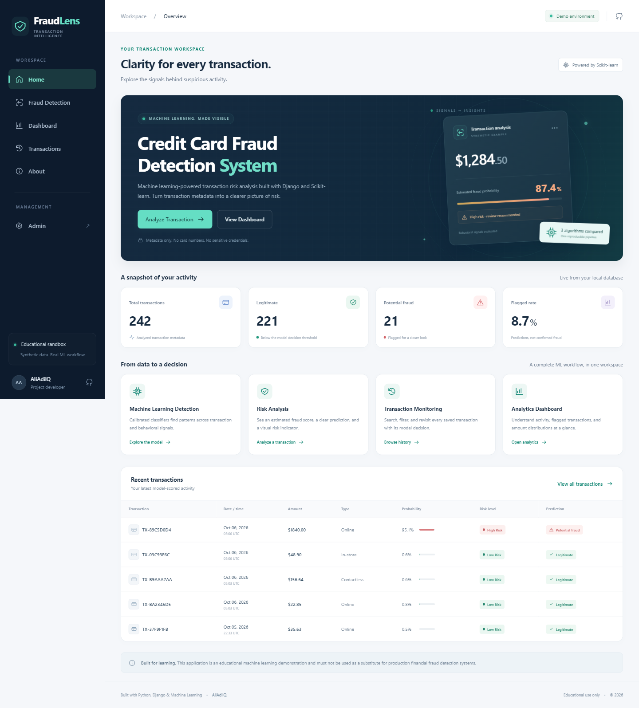
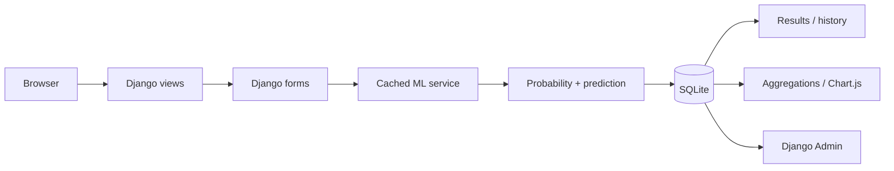
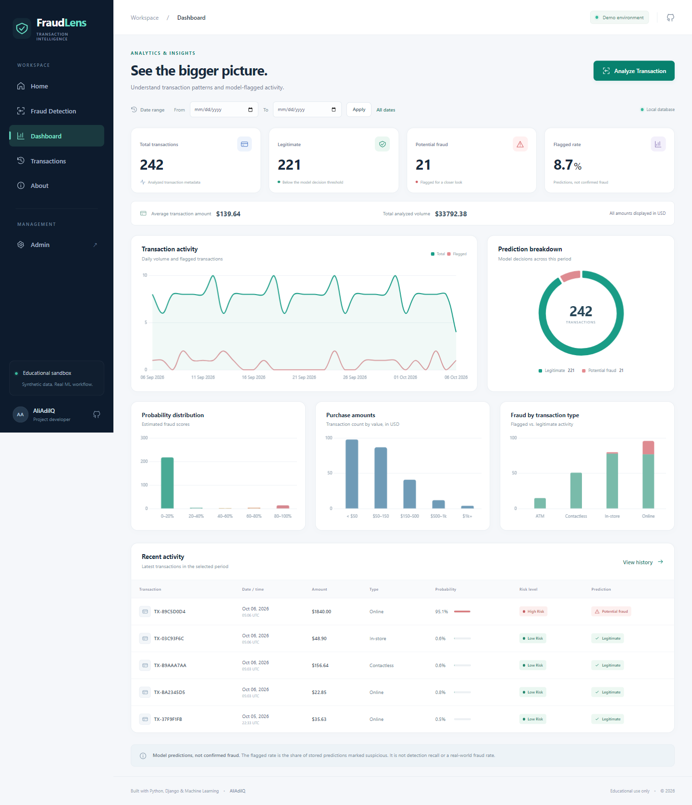
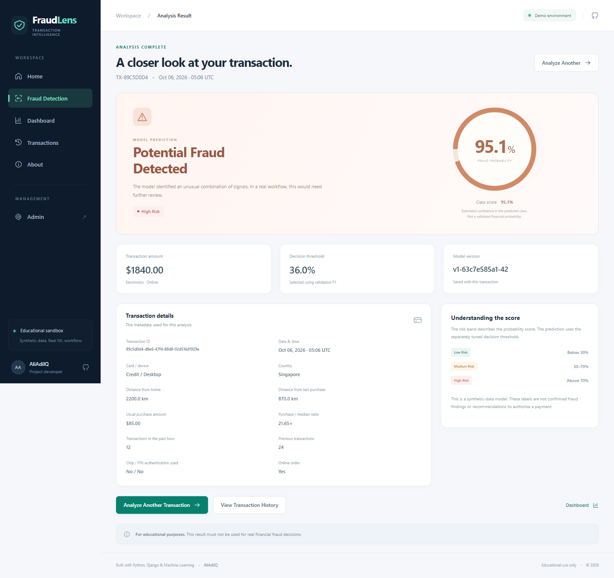
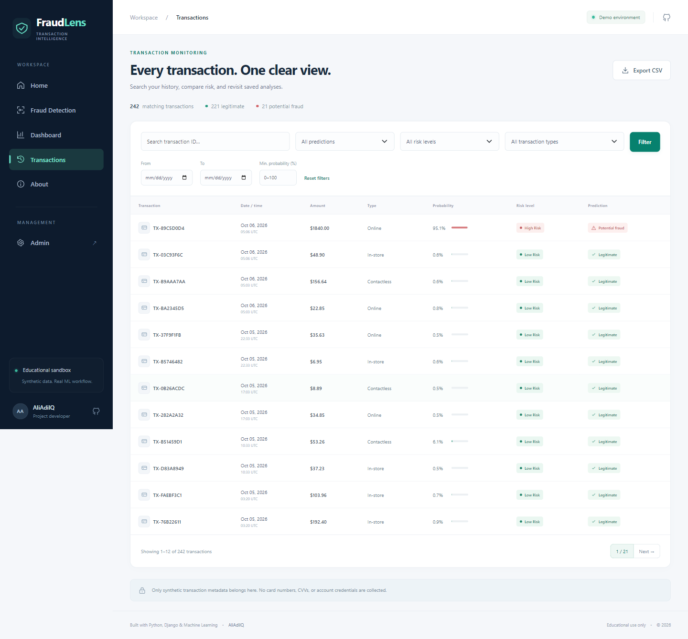
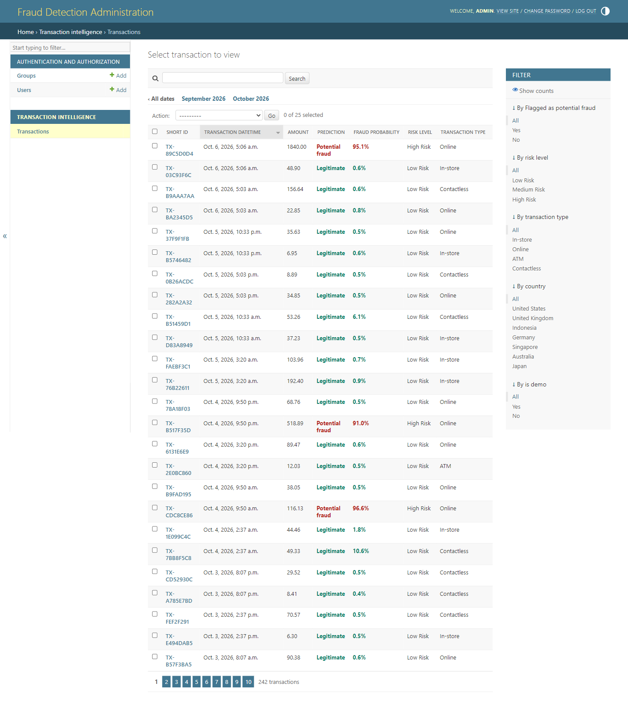

# Credit Card Fraud Detection


[](LICENSE)

**Transaction intelligence, made visible.** A complete full-stack machine learning project by **[AliAdilQ](https://github.com/AliAdilQ)**, built with Python, Django, and Scikit-learn. The FraudLens interface turns synthetic purchase metadata into saved risk analyses, searchable history, and an interactive analytics workspace.



> **Educational use only.** This application is an educational machine learning demonstration and must not be used as a substitute for production financial fraud detection systems. Submit synthetic metadata only; never submit card numbers, CVVs, PINs, or financial account credentials.

[Features](#features) · [Installation](#installation) · [Demo account](#demo-admin-account) · [Model evaluation](#model-evaluation) · [Screenshots](#screenshots) · [Documentation](#documentation)

## Features

- **Transaction risk analysis:** sectioned Django form, bounded numeric inputs, contextual validation, realistic presets, and CSRF protection.
- **Clear results:** estimated fraud probability, predicted class score, risk band, decision threshold, transaction metadata, and model provenance.
- **Analytics dashboard:** total, legitimate, flagged, flagged percentage, average amount, and total volume; five Chart.js charts with date filters.
- **Transaction monitoring:** ID search, status/type/risk/minimum-score/date filters, pagination, details, and filtered CSV export.
- **Django Admin:** authenticated transaction list with search, date navigation, sorting, filters, read-only decision details, and customized branding.
- **Reproducible ML:** 4,000 synthetic training records, three calibrated classifiers, validation-only selection, and a held-out test report.
- **Easy demo setup:** migrations, dataset generation, model training, idempotent database seeding, and safe local admin creation commands.
- **Polished frontend:** navy/teal theme, responsive navigation, mobile layouts, SVG icons, keyboard focus, reduced-motion support, and useful empty/error states.
- **Local frontend assets:** Bootstrap and Chart.js are vendored with licenses. No React, frontend build, CDN, external API, or bank integration is required to run the application.

## Demo workflow

1. Open **Home** to view your database snapshot and recent transactions.
2. Choose **Fraud Detection → Everyday purchase**, review the synthetic values, and analyze it.
3. Inspect the probability indicator, prediction, saved transaction ID, and metadata.
4. Try **Unusual activity** or change a signal and compare a new result. Sample presets do not guarantee particular classifications.
5. Open **Dashboard** for prediction breakdown, activity over time, score distribution, amount distribution, and fraud by transaction type.
6. Use **Transactions** to filter, revisit a result, or export the matching history to CSV.
7. Log into **Admin** to inspect the seeded records. Transaction metadata and decisions are read-only together to preserve score consistency.

The demo uses amounts in **USD** and timestamps in **UTC** by default. `TIME_ZONE` can change display/input time zones; ML hour is normalized to UTC. The application collects a yes/no PIN-used flag, never an actual PIN.

## Technology stack

| Layer | Technology |
| --- | --- |
| Backend | Python 3.11+, Django 5.2 LTS, Django Admin |
| Interface | HTML5, CSS3, Bootstrap 5.3.8, vanilla JavaScript, SVG icons |
| Charts | Chart.js 4.5.1 |
| Machine learning | Scikit-learn, Pandas, NumPy, Joblib |
| Development data | SQLite and generated synthetic CSV |
| Configuration / static serving | python-dotenv, WhiteNoise |
| Optional Linux hosting | Gunicorn, Procfile |
| Optional screenshot verification | Node.js and Playwright |

See [requirements.txt](requirements.txt) for compatible dependencies and [requirements-lock.txt](requirements-lock.txt) for the verified Windows/Python 3.12 environment. Django's [5.2 release documentation](https://docs.djangoproject.com/en/5.2/releases/5.2/) documents the supported Python versions.

## Installation

Install **Python 3.11 or newer** and Git. The project was verified with Python **3.12.14**. Downloading dependencies requires internet access; the running application serves its frontend libraries locally.

```bash
git clone https://github.com/AliAdilQ/credit_card_fraud_detection.git
cd credit_card_fraud_detection
python -m venv .venv
```

**Windows PowerShell**

```powershell
.\.venv\Scripts\Activate.ps1
```

**Windows Command Prompt**

```bat
.venv\Scripts\activate.bat
```

**Linux / macOS**

```bash
source .venv/bin/activate
```

If PowerShell blocks activation, use `.\.venv\Scripts\python.exe` instead of `python` in the commands below; activation is a convenience, not a requirement.

```bash
python -m pip install --upgrade pip
python -m pip install -r requirements.txt
```

### Environment configuration

Copy the example to `.env`:

```powershell
# Windows PowerShell
Copy-Item .env.example .env
```

```bash
# Linux / macOS
cp .env.example .env
```

Generate a unique secret and paste it into your local `.env`:

```bash
python -c "import secrets; print(secrets.token_urlsafe(50))"
```

```dotenv
SECRET_KEY=your-generated-secret
DEBUG=True
ALLOWED_HOSTS=127.0.0.1,localhost
TIME_ZONE=UTC
```

`.env` is ignored by Git. A private, process-local secret is generated automatically if none is supplied in debug mode, so the beginner demo can still launch. Set a persistent local secret to keep sessions stable across restarts. Non-debug configuration requires an explicit unique secret of at least 50 characters. The example placeholder is rejected in non-debug mode.

### Initialize and run

Run these commands from the repository root, with the virtual environment active:

```bash
python manage.py check
python manage.py migrate
python manage.py train_model
python manage.py seed_demo_data --reset
python manage.py create_demo_admin
python manage.py test
python manage.py runserver
```

Open **[http://127.0.0.1:8000/](http://127.0.0.1:8000/)**. SQLite is created locally by migrations and excluded from Git. The commands populate everything; no committed database is required.

| Page | Local URL |
| --- | --- |
| Home | `http://127.0.0.1:8000/` |
| Fraud Detection | `http://127.0.0.1:8000/predict/` |
| Analytics Dashboard | `http://127.0.0.1:8000/dashboard/` |
| Transaction History | `http://127.0.0.1:8000/transactions/` |
| About | `http://127.0.0.1:8000/about/` |
| Admin | `http://127.0.0.1:8000/admin/` |

## Demo Admin Account

Username: `admin`

Password: `DemoAdmin123!`

Email: `admin@example.com`

Admin URL: `http://127.0.0.1:8000/admin/`

> **These credentials are provided only for the local demonstration environment. Change the administrator password and application secrets before deploying the application publicly.**

`create_demo_admin` creates a superuser only when that username does not exist, preserves any existing password and permissions, and refuses to run with `DEBUG=False`. For your own administrator, use `python manage.py createsuperuser`.

## Dataset and demo records

The bundled [sample_transactions.csv](data/sample_transactions.csv) contains **4,000 generated transactions**, with **173 fraud labels (4.325%)**. It contains no real bank/customer information and redistributes no Kaggle dataset.

The generator creates relationships among amounts, distances, purchase ratios, frequency, prior activity, and authentication. Legitimate unusual behavior overlaps with fraudulent behavior, some fraud resembles ordinary activity, and small random label flips introduce noise. Country categories are random contextual values, not fraud rules.

```bash
# Rebuild default training data, then retrain
python manage.py train_model --regenerate

# Optional custom synthetic dataset
python manage.py generate_dataset --rows 5000 --seed 42
python manage.py train_model

# Seed or replace only demo-marked database records
python manage.py seed_demo_data
python manage.py seed_demo_data --reset
python manage.py seed_demo_data --count 300 --reset
```

The default seeding command creates **240** records over approximately 30 days. It uses a separate deterministic generator seed and enriches unusual activity for useful charts. All stored decisions come from actual model inference. Repeating the same seed command does not duplicate demo IDs. `--reset` deletes only `is_demo=True` rows and preserves manually analyzed transactions. Changing `--count` without reset can add missing IDs; use reset to replace the whole demo batch.

The screenshots include two additional transactions submitted through the real prediction form. Transaction timestamps follow the date of seeding; charts will therefore look slightly different on future runs. See [data/README.md](data/README.md) for the complete feature dictionary.

## Machine learning methodology

1. Validate metadata and derive UTC transaction hour.
2. Create **stratified 60% training / 20% validation / 20% test** partitions with seed 42.
3. Fit numeric scaling, one-hot category encoding, and binary signals inside each estimator pipeline.
4. Compare **Logistic Regression**, **Random Forest**, and **Gradient Boosting**. Balanced class weights are used for the first two.
5. Apply three-fold sigmoid calibration within the development process.
6. Tune each decision threshold on **validation F1**, breaking ties by recall; select the model by validation F1, then recall, then ROC-AUC.
7. Refit the winner on training plus validation data and evaluate once on the untouched test partition.
8. Save a compressed Joblib artifact and a versioned JSON evaluation report.

Accuracy is reported alongside minority-class metrics, not used as the primary selection criterion. Calibration methodology follows Scikit-learn's [probability calibration documentation](https://scikit-learn.org/stable/modules/calibration.html). Calibration on synthetic data does not establish probabilities for real financial transactions.

## Model evaluation

Measured on **800 held-out synthetic transactions**, with **35 fraud labels**, using the bundled default dataset and verified environment. Selected model: **Gradient Boosting**, calibrated with sigmoid cross-validation. Decision threshold: **0.36**.

| Held-out test metric | Result |
| --- | ---: |
| Accuracy | 98.125% |
| Precision | 83.333% |
| Recall | 71.429% |
| F1 score | 0.7692 |
| ROC-AUC | 0.8972 |
| Average precision | 0.7693 |
| Brier score (lower is better) | 0.0163 |

| Validation candidate | Precision | Recall | F1 | Tuned threshold |
| --- | ---: | ---: | ---: | ---: |
| Logistic Regression | 0.595 | 0.714 | 0.649 | 0.16 |
| Random Forest | 0.714 | 0.714 | 0.714 | 0.16 |
| Gradient Boosting | 0.793 | 0.657 | 0.719 | 0.36 |

**Test confusion matrix**

| Actual / Predicted | Legitimate | Potential fraud |
| --- | ---: | ---: |
| Legitimate | 760 | 5 |
| Fraud | 10 | 25 |

The model misses 10 of 35 synthetic fraud cases and flags 5 legitimate cases in this test set. These are demonstration metrics, not evidence of real banking performance. Exact results and dependency versions are in [models/evaluation.json](models/evaluation.json); methodology and limitations are in [docs/model.md](docs/model.md). Retraining with different data, seeds, or library versions can change results. The table above describes the bundled default artifact.

### How to read scores

| Risk band | Estimated fraud score |
| --- | --- |
| Low Risk | Below 30% |
| Medium Risk | 30% through 70% |
| High Risk | Above 70% |

Risk bands describe score ranges; binary predictions use the separately selected **0.36** threshold. The class score shown as confidence is `p` for a flagged prediction and `1 − p` for a legitimate prediction. Neither is a guarantee or validated financial probability. Dashboard **flagged rate** counts stored predictions; it is not measured recall, a confirmed fraud percentage, or an accuracy statistic.

## Project architecture



## Folder structure

```text
credit_card_fraud_detection/
├── manage.py
├── requirements.txt / requirements-lock.txt
├── .env.example / .gitignore
├── README.md / LICENSE / CONTRIBUTING.md
├── SECURITY.md / CODE_OF_CONDUCT.md
├── Procfile / runtime.txt
├── fraud_detection/            # Settings, URLs, WSGI, ASGI
├── detection/
│   ├── models.py / forms.py / views.py / urls.py / admin.py
│   ├── analytics.py / tests.py
│   ├── migrations/             # Committed database migration
│   ├── ml/                    # Schema, preprocessing, generator, training, service
│   └── management/commands/   # generate_dataset, train_model, seed_demo_data,
│                              # create_demo_admin
├── templates/                 # Pages + shared components + 404/500
├── static/
│   ├── css/ / js/ / images/
│   └── vendor/                # Bootstrap, Chart.js, original licenses
├── data/                      # Synthetic CSV + dictionary
├── models/                    # Trusted Joblib artifact + evaluation JSON
├── screenshots/               # Actual browser captures
├── scripts/                   # Optional screenshot capture + vendor fetch
├── docs/                      # Architecture, model, verification
└── .github/workflows/         # Cross-platform Django checks
```

## Screenshots

These are actual screenshots of the running, seeded application at a **1440 × 900 viewport**, captured as full pages. The prediction result comes from submitting the unusual-activity sample through the real form; the admin capture comes from an authenticated session.

### Analytics Dashboard



### Fraud Prediction



### Transaction History



### Admin Panel



Also included: [prediction form](screenshots/prediction-form.png) and [mobile home](screenshots/mobile-home.png).

### Regenerate screenshots (optional)

The application itself requires only Python. For automated browser captures, install Node.js and the optional development tools:

```bash
npm install
npx playwright install chromium
```

Start the configured, migrated, trained, seeded Django server in one terminal. In a second terminal:

```bash
npm run screenshots
```

The script creates two saved predictions, captures the required pages, logs into the local demo admin, verifies five charts, CSV export, filtering, and mobile navigation, and fails on browser errors or missing local assets. Use it only against a local synthetic demo. Set `DEMO_URL`, `DEMO_ADMIN_USERNAME`, and `DEMO_ADMIN_PASSWORD` if you changed the local port/account. `CHROMIUM_EXECUTABLE` optionally points to an existing Chromium binary. See [screenshots/README.md](screenshots/README.md).

## Testing

```bash
python manage.py check
python manage.py makemigrations --check --dry-run
python manage.py test
```

The **27-test** suite covers home and other pages, transaction properties, field validation, future dates, non-finite inputs, prediction persistence and redirect, missing/corrupt model handling, CSRF, filters, pagination, empty data, custom 404, actual admin access, idempotent demo commands, risk boundaries, deterministic class imbalance, feature schema, and a real train/save/load/infer round trip with stratified split checks. It trains a smaller isolated fixture rather than overwriting the bundled artifact.

The optional Playwright script exercises the working application in desktop and mobile browsers. [Verification notes](docs/verification.md) record the checks performed for this repository. CI runs Django checks/tests on Linux and Windows using Python 3.11/3.12.

## Error handling and troubleshooting

| Situation | Behavior / fix |
| --- | --- |
| Missing or incompatible model | Form retains values, shows a friendly service-unavailable message, and does not save a transaction. Run `python manage.py train_model`. |
| Invalid input | Field errors preserve the submitted values; inference is skipped. |
| Empty database or filtered range | Zero-safe KPIs and a helpful empty state. Seed the demo or widen filters. |
| Unknown page/transaction | Custom 404 in non-debug mode. Django's diagnostic 404 is expected during local debug development. |
| Browser styles/charts | Libraries are local. Confirm the files under `static/vendor/` exist. |
| `No module named django` | Use Python 3.11+ from the activated virtual environment and install requirements. |
| Port already used | `python manage.py runserver 8001`, then use `http://127.0.0.1:8001/`. |
| Existing admin password differs | The demo command preserves existing accounts. Use `python manage.py changepassword admin`. |

Unexpected model-loading or inference errors are logged without displaying raw technical exceptions in the prediction form. Non-debug requests use custom 404/500 pages. Debug mode is for local development only.

## Security and deployment notes

Read [SECURITY.md](SECURITY.md). `.env`, databases, dependency caches, and virtual environments are ignored. Forms validate choices/ranges, templates escape output, chart JSON uses safe `json_script`, and POST requests require CSRF. No real card credentials are collected.

The included `Procfile` and `runtime.txt` are a starting point for a Linux Gunicorn host. Before public hosting, use fresh secrets/admin credentials, `DEBUG=False`, exact allowed hosts, trusted HTTPS origins, and collected static files:

```bash
python manage.py collectstatic --noinput
python manage.py check --deploy
```

Non-debug mode enables secure cookies, HTTPS redirect, and HSTS. Configure TLS and a trusted reverse proxy according to your hosting platform; do not blindly trust forwarded headers. Production also needs authentication/authorization for transaction access, rate limits, monitoring, data retention, a durable database, and a representative validated model. The development server and demonstration account are not production infrastructure. Load only trusted Joblib files: pickle can execute code.

## Model limitations

- Synthetic profiles do not reproduce real banking distributions or evolving attacker behavior.
- Generated historical activity is informative in this demo but is not a validated real-world predictor.
- False positives and missed fraud are unavoidable; model scores need external validation and human governance before operational use.
- IID synthetic splits do not establish customer-level or chronological generalization.
- No payment processing, live monitoring, bank data, production alerting, or claim of regulatory suitability is included.

## Future improvements

- REST API with Django REST Framework and authenticated clients.
- PostgreSQL deployment, Docker packaging, and cloud infrastructure.
- Real-time monitoring and a transaction review workflow with role-based authentication.
- Explainable AI / SHAP and investigator-facing evidence.
- Anomaly detection and advanced class imbalance techniques.
- Opt-in email alerts, model monitoring, temporal backtesting, and drift detection.

## Documentation

- [Architecture](docs/architecture.md)
- [Model methodology](docs/model.md)
- [Dataset dictionary](data/README.md)
- [Model artifacts and compatibility](models/README.md)
- [Screenshots](screenshots/README.md)
- [Verification](docs/verification.md)

## Contributing

Fork the repository, create a branch, add a focused change, run the checks, and open a pull request. See [CONTRIBUTING.md](CONTRIBUTING.md) and [CODE_OF_CONDUCT.md](CODE_OF_CONDUCT.md).

## License

[MIT License](LICENSE) · Copyright (c) 2026 AliAdilQ. Vendored frontend libraries retain their original MIT licenses in `static/vendor/`.

## Author

**AliAdilQ** — Python development, Django, machine learning, data science, and fraud analytics.

- GitHub profile: [github.com/AliAdilQ](https://github.com/AliAdilQ)
- Repository: [github.com/AliAdilQ/credit_card_fraud_detection](https://github.com/AliAdilQ/credit_card_fraud_detection)

**This project is a portfolio and educational demonstration. Never use its predictions to make real financial fraud decisions.**
