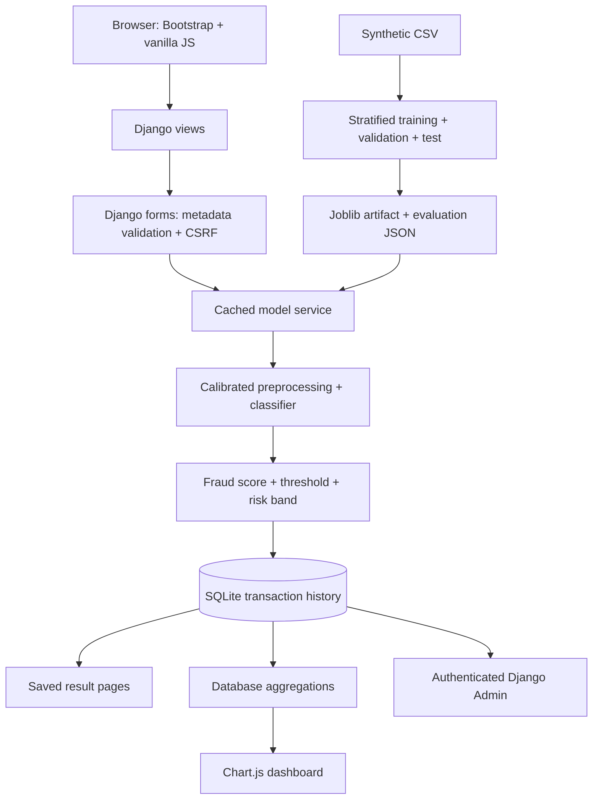

# Application architecture

`detection/models.py` defines metadata and prediction provenance. No payment credentials are stored. `forms.py` validates numeric bounds, dates, choices, and online-order consistency before inference. `ml/schema.py` is the shared feature contract. `ml/preprocessing.py` derives UTC hour and constructs a numeric scaling/categorical encoding transformer. Fitting happens only inside training folds.

`ml/model_service.py` owns local artifact loading, caching, inference, and score interpretation. `ml/training.py` compares three calibrated algorithms, tunes thresholds on validation data, refits the winner on development data, and evaluates once on the held-out test partition. Management commands handle dataset generation, training, demo seeding, and local admin setup.

`views.py` orchestrates requests; `analytics.py` centralizes real database aggregates. Successful prediction POSTs redirect to UUID result URLs to prevent refresh duplicates. Result URLs and history are public in the local sandbox. Admin is authenticated and exposes transactions as read-only records (with deletion permitted) so edited metadata cannot invalidate a saved score. CSRF protects POST requests. CSV export applies the same validated filters as history.

Templates use Django escaping, named URLs, and JSON-script encoding for chart payloads. Vendored Bootstrap and Chart.js avoid network dependencies when browsing the running app. Custom styles share one responsive theme, and tables scroll within their containers on narrow devices.

The database and `.env` are excluded from Git. The dataset, model, evaluation report, migrations, screenshots, and documentation are included. The `Procfile` is a starting point for a Linux Gunicorn host, not a completed production deployment. WhiteNoise serves collected static files; public hosting also needs appropriate secrets, TLS/proxy configuration, authentication, authorization, rate limits, monitoring, and a durable database.
